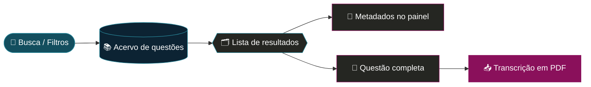

<div align="center">


<br/>

[](https://le4ndror.github.io/onhbemdados.js/ONHB_Network-main/web/)
[](https://www.olimpiadadehistoria.com.br)


### 👉 [**le4ndror.github.io/onhbemdados.js/ONHB_Network-main/web/**](https://le4ndror.github.io/onhbemdados.js/ONHB_Network-main/web/) 👈

</div>

---

## 📜 Sobre o projeto

O **Repositório da ONHB** é um acervo digital de questões da **Olimpíada Nacional em História do Brasil**, organizado para quem estuda, pesquisa e ensina História.

Cada questão é tratada como um pequeno documento: ela reúne a **fonte histórica primária** em que se baseia, a **autoria**, a **datação**, o **tipo de documento**, o **acervo de origem** e a **transcrição**, tudo em um só lugar e pesquisável.

O projeto é desenvolvido no contexto do **LEIAH — Laboratório de Estudos e Investigações em Ensino de História**.

> 💡 A ideia é simples: transformar décadas de provas em um banco de dados vivo, que dá para filtrar por período, tema, fase e edição.

---

## ✨ O que você encontra no site

| | Recurso | Descrição |
|---|---|---|
| 🔎 | **Busca instantânea** | Procure por palavra-chave, tema, autor ou período. Atalho: `Ctrl + K` |
| 🎚️ | **Filtros combináveis** | Fase, período histórico, intervalo de anos da fonte, edição da ONHB e temas |
| 🗂️ | **Cartões de questões** | Lista limpa e ordenável, com contador de resultados e filtros ativos visíveis |
| 🧾 | **Inspetor de metadados** | Painel lateral com imagem da fonte, autoria, datação, tipo e acervo |
| 📖 | **Visualização completa** | Janela com a fonte primária, a descrição e o contexto da questão |
| 📥 | **Transcrição em PDF** | Baixe a transcrição da fonte para usar em sala ou em pesquisa |
| 🌍 | **Globo 3D interativo** | Ao lado do título: arraste para girar, passe o mouse para pausar |

---

## 🧭 Filtros disponíveis

```text
 ┌──────────────────────────── FILTROS DE BUSCA ────────────────────────────┐
 │                                                                          │
 │  Fase ............ 1ª fase · 2ª fase · 3ª fase · Fase Final              │
 │  Período ......... Brasil Colonial · Império · República                 │
 │  Intervalo ....... 1500 ──────────────────────────────────────── 2026    │
 │  Edição .......... 2021 (13ª) · 2022 (14ª) · 2023 (15ª) · 2024 (16ª)     │
 │  Temas ........... Escravidão · Economia · Cultura · ...                 │
 │                                                                          │
 └──────────────────────────────────────────────────────────────────────────┘
```

<div align="center">


</div>

---

## 🔄 Como funciona



---

## 🎨 Identidade visual

| Cor | Hex | Uso |
|---|---|---|
| 🟦 Azul-petróleo | `#134e5e` | Cor principal, botões e destaques |
| 🌊 Azul-marinho | `#0c2333` | Cabeçalho e rodapé |
| 🟪 Magenta | `#8A105B` | A sigla **ONHB** e ações importantes |
| ⬛ Grafite | `#1c1d1a` | Fundo do tema escuro |

**Tipografia:** *Montserrat* nos títulos, *Lora* nos textos de destaque e *Inter* na interface.

---

## 🛠️ Tecnologias

- **HTML5 + JavaScript** puro, sem etapa de build
- **Tailwind CSS** (via CDN) para o layout e o tema escuro
- **Font Awesome** para os ícones
- **three.js** para o globo 3D (pontos dos continentes, grade, contorno e marcadores pulsantes sobre o Brasil)
- Dados dos continentes do **Natural Earth**

---

## 🚀 Rodando localmente

```bash
# 1. clone o repositório
git clone https://github.com/le4ndror/onhbemdados.js.git

# 2. entre na pasta do site
cd onhbemdados.js/ONHB_Network-main/web

# 3. abra no navegador
#    (basta abrir o index.html, ou usar um servidor local)
python3 -m http.server 8000
```

Depois acesse `http://localhost:8000`.

> ℹ️ Algumas bibliotecas e os dados do globo são carregados da internet, então é preciso estar conectado. Sem conexão, o globo aparece só com a grade e os marcadores.

---

## 🤝 Contribuindo

Sugestões, correções de transcrição e novas fontes são bem-vindas:

1. Faça um *fork* do projeto
2. Crie uma branch: `git checkout -b minha-contribuicao`
3. Faça o commit: `git commit -m "Descreve a mudança"`
4. Envie: `git push origin minha-contribuicao`
5. Abra um *Pull Request*

---

<div align="center">

**LEIAH** · Laboratório de Estudos e Investigações em Ensino de História

Feito com 📚 para quem ensina e aprende História do Brasil

[🌐 Site](https://le4ndror.github.io/onhbemdados.js/ONHB_Network-main/web/) · [🏛️ ONHB oficial](https://www.olimpiadadehistoria.com.br)

</div>
